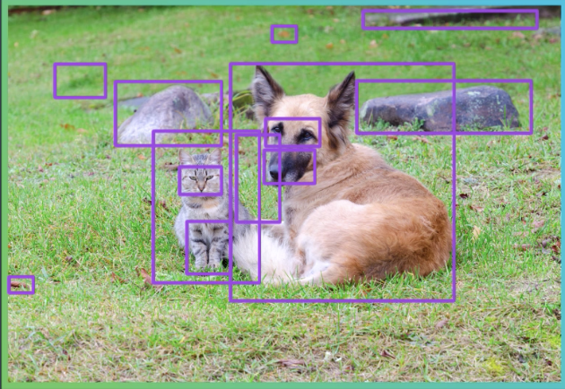
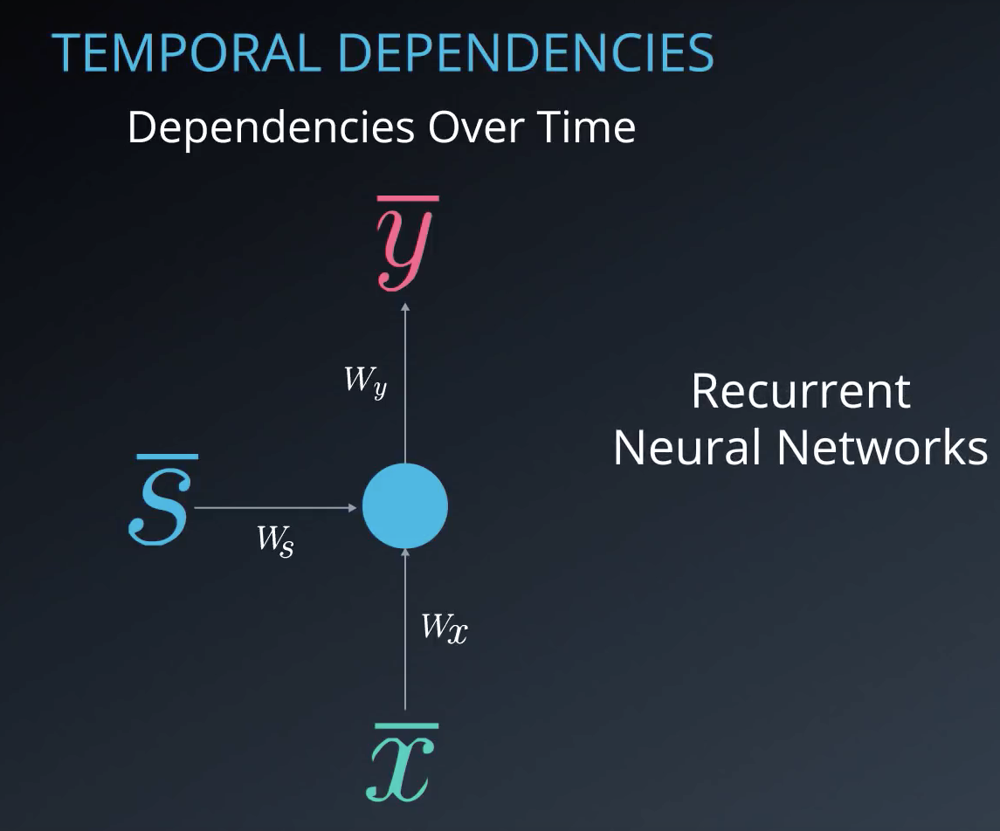
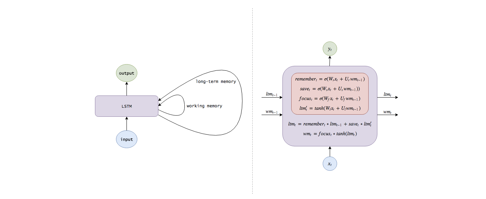
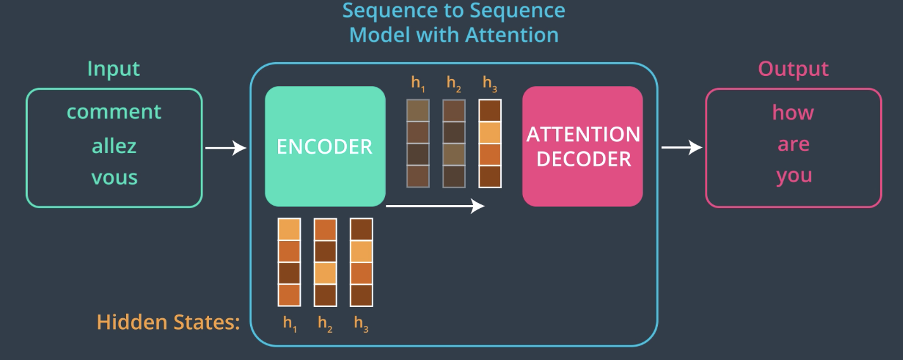

# Udacity Computer Vision Nanodegree Part 2: Advanced Computer Vision & Deep Learning

This repository covers 5 topics:

1. [Advanced CNN Architectures](/EvolutionOfR-CNN.ipynb) 
 
Credits: Udacity Computer Vision Nanodegree 

Describtions of various neural networks architectures for object recognition and detection: *R-CNN*, *Fast R-CNN* and *Faster R_CNN*. Enjoy :smile:

2. [YOLO](/YOLO.ipynb) 
*In progress*

3. [RNN's](/RNN.ipynb)

 
Credits: Udacity Computer Vision Nanodegree 

Explanation of Reccurent Neural Network structure. You can find here description of *Unfolded model* as well as *Backpropagation through time* :curly_loop:

4. [Long Short-Term Memory Networks (LSTMs)](/LSTM.ipynb)

 
Credits: Udacity Computer Vision Nanodegree 

If you wonder how does exactly LSTM cell receive input, process it and returns output click :point_right: [here](/LSTM.ipynb) :point_left:  
However, if you are interested in implementation of LSTM models you may check [Part of Speech Tagging](/LSTM_PartOfSpeechTagging.ipynb) :speech_balloon: or [Character Level LSTM: generate another chapter of Anna Karenina](/LSTM_CharacterLevel.ipynb) :closed_book:  

5. [Attention Mechanisms](/AttentionMechanisms.ipynb) :heart: :hatched_chick:

 
Credits: Udacity Computer Vision Nanodegree 

Overview of how does *Attention* can be used to deal with problems in sequence to sequence models. Also, you can find here detailed description of how *Encoder* and *Decoder* works in such models and how does it connects with *Attention Mechanisms*.

Final Project will be to implement an effective RNN decoder for a CNN encoder to predict captions for a given image. It can be found in this [repository](https://github.com/paluchnuggets/ImageCaptioningProject).
